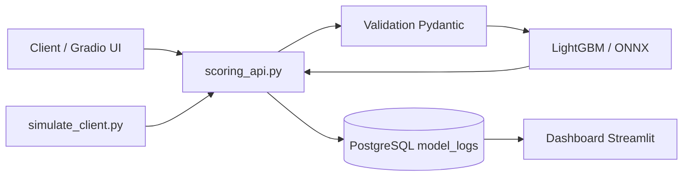

# OC-Projet-8 — API de scoring crédit

Projet de formation OpenClassroom (Projet 8) : mise en production d'un modèle de **scoring crédit** (LightGBM) avec journalisation PostgreSQL, interface Gradio, dashboard de monitoring Streamlit et pipeline CI/CD, évaluation de la
performance du pipeline d'inférence et optimisation onnx.

## Table des matières

- [Contexte](#contexte)
- [Fonctionnalités](#fonctionnalités)
- [Architecture](#architecture)
- [Prérequis](#prérequis)
- [Installation](#installation)
- [Configuration PostgreSQL](#configuration-postgresql)
- [Lancement](#lancement)
- [Structure du projet](#structure-du-projet)
- [API Gradio](#api-gradio)
- [Monitoring](#monitoring)
- [Tests et couverture](#tests-et-couverture)
- [CI/CD](#cicd)
- [Docker](#docker)
- [Base de données et optimisation](#base-de-données-et-optimisation)
- [Données et modèles](#données-et-modèles)

## Contexte

Ce dépôt couvre le cycle de vie complet d'un modèle ML en contexte métier :

1. Entraînement et export du modèle (notebooks, pipeline sklearn/LightGBM).
2. Exposition via une **API Gradio** avec validation Pydantic des entrées.
3. **Journalisation** de chaque requête (succès ou erreur) dans PostgreSQL.
4. **Monitoring** post-déploiement (volume, latence, taux d'erreur, distribution des prédictions).
5. **Optimisation** des performances (profiling, conversion ONNX).

## Fonctionnalités

| Composant | Description |
|-----------|-------------|
| **API Gradio** | Saisie interactive des features, validation, prédiction, endpoint REST `/score_client` |
| **Validation** | Schéma Pydantic (`data/schema/typeAdapters.json`) sur les paramètres utilisateur |
| **Inférence** | Modèle pickle (`lgb_model.pkl`) ou ONNX (`onnx_model.onnx`) |
| **Logs PostgreSQL** | Table `model_logs` : params, prédiction, latence, erreurs |
| **Dashboard Streamlit** | 4 pages : vue d'ensemble, volume, performance, prédictions |
| **Simulateur client** | Génération de profils et charge API via `gradio_client` |
| **CI** | Lint Ruff + pytest avec couverture minimale **90 %** |

## Architecture



## Prérequis

- **Python** ≥ 3.11
- **[uv](https://docs.astral.sh/uv/)** (gestionnaire de dépendances recommandé)
- **PostgreSQL** ≥ 14 (local ou distant)
- **Git** (optionnel : Git LFS pour `lgb_model.pkl`)

## Installation

```bash
git clone <url-du-depot>
cd OC-Projet-8

# Installer Python 3.11 et les dépendances
uv python install 3.11
uv sync --locked
```

Alternative sans uv :

```bash
python -m pip install -e .
```

## Configuration PostgreSQL

La connexion est définie dans `src/database/database.py` :

| Paramètre | Valeur par défaut |
|-----------|-------------------|
| Base | `scoring_db` |
| Utilisateur | `scoring_app` |
| Mot de passe | `scoring_app_pswd` |
| Hôte | `localhost` |
| Port | `5432` |

### Initialisation de la base

1. Démarrer PostgreSQL.
2. Exécuter le notebook `src/notebooks/creat_db.ipynb` pour créer :
   - l'utilisateur et la base `scoring_db` ;
   - la table `model_logs` (colonnes : `request_id`, `requested_at`, `requested_params`, `event_time`, `pred_class`, `execution_time_ms`, `error`, `error_message`).

> **Important** : l'API et le dashboard nécessitent une base accessible avec la table `model_logs` déjà créée.

## Lancement

Depuis la **racine du projet** :

### API de scoring (Gradio)

```bash
uv run python src/api/scoring_api.py
# ou
python -m src.api.scoring_api
```

Interface disponible sur [http://127.0.0.1:7860](http://127.0.0.1:7860).

### Dashboard de monitoring (Streamlit)

```bash
uv run streamlit run src/monitoring/app.py
```

### Simulateur de charge

Configurer les variables en tête du bloc `if __name__ == "__main__"` dans `src/database/simulate_client.py`, puis :

```bash
uv run python src/database/simulate_client.py
```

Le simulateur peut générer des profils (`data/profils.json`) et appeler l'endpoint `/score_client` avec des dates simulées.

## Structure du projet

```
OC-Projet-8/
├── src/
│   ├── api/              # API Gradio (scoring_api.py)
│   ├── database/         # Connexion PostgreSQL + simulateur client
│   ├── monitoring/       # Dashboard Streamlit + agrégations (data.py)
│   ├── model/            # lgb_model.pkl, onnx_model.onnx
│   ├── utils/            # Utilitaires ML (SMOTE, coût métier)
│   ├── notebooks/        # Exploration, création BDD, 
│   │                     # estimation de performances, rapport d'optimisation
│   └── tests/            # Tests unitaires et d'intégration
├── data/
│   ├── original/         # Données de démonstration
│   └── schema/           # Schéma de validation Pydantic
├── outputs/              # Graphiques de performance
├── Dockerfile            # Image Docker (Gradio, port 7860)
└── pyproject.toml        # Dépendances, pytest, couverture
```

## API Gradio

### Endpoints exposés

| Endpoint | Fonction | Description |
|----------|----------|-------------|
| `/validate_params` | `validate_params` | Valide les types des features saisies |
| `/predict` | `infer_from_new_vector` | Infère à partir de paramètres validés |
| `/score_client` | `process_scoring_request` | Flux complet : validation → prédiction → log BDD |

### Exemple d'appel programmatique

```python
from gradio_client import Client

client = Client("http://127.0.0.1:7860")

result = client.predict(
    {
        "AMT_CREDIT": 6000.0,
        "DAYS_BIRTH": -140,
        "DAYS_EMPLOYED": -1000.0,
        "EXT_SOURCE_1": 0.5,
        "EXT_SOURCE_2": 0.3,
        "EXT_SOURCE_3": 0.2,
        "client_installments_AMT_PAYMENT_min_sum": 1000.0,
        "previous_CNT_PAYMENT_mean": 12.0,
        "bureau_DAYS_CREDIT_max": -100.0,
        "client_cash_CNT_INSTALMENT_FUTURE_min_mean": 5.0,
    },
    "2026-03-15T10:30:00",
    api_name="/score_client",
)
```

Les 10 features exposées à l'utilisateur sont listées dans `data/schema/typeAdapters.json`.

## Monitoring

Le dashboard Streamlit (`src/monitoring/app.py`) interroge la table `model_logs` et affiche :

- **Vue d'ensemble** : KPIs globaux, volume et taux d'erreur journaliers.
- **Volume & fiabilité** : répartition succès/erreurs, top types d'erreurs.
- **Performance** : latence P50/P95, temps moyen par type d'événement.
- **Prédictions** : distribution des classes prédites (requêtes réussies).

L'axe temporel utilise `COALESCE(event_time, requested_at)`.

## Tests et couverture

```bash
# Depuis la racine du projet
python -m pytest --cov
```

| Paramètre | Valeur |
|-----------|--------|
| Seuil minimal | **90 %** (`--cov-fail-under=90`) |
| Périmètre | Logique métier (`src/`) |
| Exclusions | UI Gradio/Streamlit, fichiers `__init__.py`, tests |

Configuration dans `pyproject.toml` :

- `pythonpath = ["."]` — résout les imports `from src.xxx`
- `pytest-cov` — rapport terminal avec lignes manquantes

## CI/CD

### CI (`.github/workflows/CI_pipeline.yml`)

Déclenchée sur les pull requests vers `main`, `prod`, `dev` :

1. **quality** — lint avec Ruff.
2. **tests** — pytest + couverture ≥ 90 % (Python 3.11, uv).

### CD (`.github/workflows/CD_pipeline.yml`)

Synchronisation automatique vers [Hugging Face Spaces](https://huggingface.co/spaces/JPoitreau/OC-Projet-8) à chaque push sur `prod`.

## Docker

```bash
docker build -t oc-projet-8 .
docker run -p 7860:7860 oc-projet-8
```

L'image utilise Python 3.11, installe les dépendances via `uv sync --locked` et lance `scoring_api.py` sur le port **7860**.


## Base de données et optimisation:

- `src/notebooks/creat_db.ipynb` — création de la base PostgreSQL.
- `src/notebooks/processing_performances.ipynb` — évaluation des performances et export ONNX.

## Données et modèles

| Fichier | Description |
|---------|-------------|
| `data/original/demonstration_data.csv` | Données de démonstration (features complètes) |
| `data/original/training_data.csv` | Jeu d'entraînement complet (**gitignoré**, usage local) |
| `data/schema/typeAdapters.json` | Types Pydantic des 10 features utilisateur les plus explicatives du modèle|
| `src/model/lgb_model.pkl` | Pipeline LightGBM entraîné (sklearn) |
| `src/model/onnx_model.onnx` | Modèle exporté pour inférence ONNX Runtime |

### Features utilisateur (API)

Features les plus explicatives du modèle de scoring:
`EXT_SOURCE_1`, `EXT_SOURCE_2`, `EXT_SOURCE_3`, `client_installments_AMT_PAYMENT_min_sum`, `DAYS_EMPLOYED`, `AMT_CREDIT`, `DAYS_BIRTH`, `previous_CNT_PAYMENT_mean`, `bureau_DAYS_CREDIT_max`, `client_cash_CNT_INSTALMENT_FUTURE_min_mean`.

Les features manquantes sont imputées par le pipeline du modèle.

---

**Stack principale** : Python 3.11 · LightGBM · Gradio · Streamlit · PostgreSQL · SQLAlchemy · ONNX Runtime · uv · pytest · Ruff
